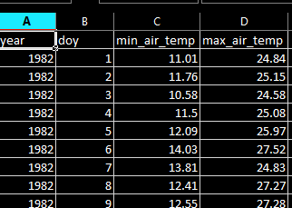
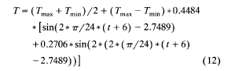
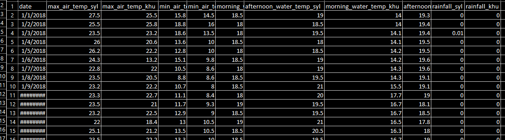
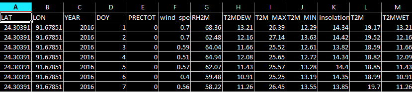

```{r setup, include=FALSE}
knitr::opts_chunk$set(echo = TRUE)
```

## Air temperature to water temperature

### Data Preparation

We will prepare the required input data first. The maximum and minimum air temperature is already downloaded from NASA in a csv file. We have two CSVs, one for Khulna and another for Srimangal -- **min_max_air_srimangal.csv** and **min_max_air_khulna.csv**. These files contain minimum and maximum air temperature from 1982 to 2019.

The following is a screenshot of the first few lines of the file **min_max_air_srimangal.csv**.



Now, make a vector of two districts, all 3-hourly time starting from 0 AM going to 21 PM and load the required packages.

```{r}
library(dplyr)
library(solrad)
longitude = c(91.678491, 89.441359)
latitude = c(24.303856, 22.800875)
areas = c("srimangal", "khulna")
longitude = c(91.678491, 89.441359)
latitude = c(24.303856, 22.800875)

# 3-hourly time starting from 0 to 21
time_of_the_day = seq(0, 21, 3)

pond_depth = 1.5204 # in meters
each_layer_depth = pond_depth / 3
```

```{r}
# Constants
sigma_const = 2.07 * (10 ** (-7)) # Stefan-Boltzman constant, unit KJ.m2/hr/K^4
```


Now, create a function that reads meteorological data according to different area, day and year.


```{r}
read_met_data_climatology = function(day, area, year_p){
  if(area == 1){
    district = "srimangal"
  }else{
    district = "khulna"
  }
  all_data = read.csv(paste0("min_max_air_", district, ".csv"))
  all_data = all_data[all_data$doy == day & all_data$year == year_p, ]
  return(all_data)
}
```

Now, we define a function that calculates diurnal temperature for a single day based on the equation 12 from Culberson and Piedrahita (1994). The following equation implies that the simulation starts at 6 AM. 



Now, write a function **calculate_diurnal_air_temperature_historical(i, area, year_p)** that calculates air temperature for a 24 hour duration from 6 AM for a day of the year **i**, area **area** and for a given year **year_p**. As we are considering three-hourly data and as the simulations starts from 6 AM, for any given day of a year for an area, it will calculate temperature for 6 AM, 9 AM, 12 PM, 3 PM, 6 PM, 9 PM, 12 AM and 3 AM 12 AM and 3 AM corresponds to the next day.

```{r}
calculate_diurnal_air_temperature_historical = function(i, area, year_p){
  # Read the air temperature data
  temp_historical = read_met_data_climatology(i, area, year_p)
  tmax_air = temp_historical$max_air_temp
  tmin_air = temp_historical$min_air_temp
  # 3 hourly time
  hours = seq(0,21,3)
  
  temp_at_different_times = sapply(hours, function(hour){((tmax_air + tmin_air)/2 + (tmax_air - tmin_air)*0.4484 *(sin(2*(pi/24)*(hour + 6) - 2.7489) + 0.2706 * sin(2 * (2 * (pi/24)* (hour + 6) - 2.7489)))) + 273.15})
  
  area = rep(areas[area], 8)
  year = rep(year_p, 8)
  
  if((i != 365 & i != 366) | (year_p %%4 == 0 & i == 365)){
    # If the day is not the last day of the year, the day of the year for temperature at 0 and 3 AM will be the immediate next day in the given year
    temp_for_a_single_day = data.frame(time = c(6,9,12,15,18,21,0,3), day = c(i,i,i,i,i,i,i+1,i+1), area = area, year = year_p, air_temp = temp_at_different_times)
  } else if((year_p%%4 != 0 & i == 365) | (year_p%%4 == 0 & i == 366)){
    #  If the day is the last day of the year, the day of the year for temperature at 0 and 3 AM will be for the first day of the next year
    temp_for_a_single_day = data.frame(time = c(6,9,12,15,18,21,0,3), day = c(i,i,i,i,i,i,1,1), area = area, year = c(rep(year_p, 6), year_p + 1, year_p + 1), air_temp = temp_at_different_times)
  } 
  
  return(temp_for_a_single_day)
}
```


Let's check if the function works or not.

```{r}
# Change the value of the arguments
calculate_diurnal_air_temperature_historical(1,1,1982)
```

As this function gives the minimum value at 6 AM and the maximum at 3 PM, it looks like the function is working.

Now, for Srimangal, from 1982 to 2019, calculate 3-hourly diurnal air temperature and save it as a separate csv file.

```{r}
diurnal_air_temp_sri = data.frame(time = numeric(0), day = numeric(0), area= character(), year=numeric(0), air_temp = numeric(0), stringsAsFactors=FALSE)

for(j in 1982:2019){
  
  # data_holder = data.frame(value = factor(), type = factor(), year = factor(), month = factor(), model = factor(), rcp = factor())
  if(j%%4 == 0){
    number_of_days = 366} else{
      number_of_days = 365
    }
  out = vector("list", length(number_of_days))
  for(i in 1:number_of_days){
    out[[i]] = calculate_diurnal_air_temperature_historical(i,1,j)
  }
  vv1 = as.data.frame(do.call(rbind, out))
  diurnal_air_temp_sri = rbind(diurnal_air_temp_sri, vv1)
}

write.csv(diurnal_air_temp_sri, "diurnal_air_temp_sri.csv")
```

Similarly, for Khulna, calculate diurnal air temperature and save it as a separate csv file.

```{r}
diurnal_air_temp_khu = data.frame(time = numeric(0), day = numeric(0), area= character(), year=numeric(0), air_temp = numeric(0), stringsAsFactors=FALSE)

for(j in 1982:2019){
  
  # data_holder = data.frame(value = factor(), type = factor(), year = factor(), month = factor(), model = factor(), rcp = factor())
  if(j%%4 == 0){
    number_of_days = 366} else{
      number_of_days = 365
    }
  out = vector("list", length(number_of_days))
  for(i in 1:number_of_days){
    out[[i]] = calculate_diurnal_air_temperature_historical(i,2,j)
  }
  vv1 = as.data.frame(do.call(rbind, out))
  diurnal_air_temp_khu = rbind(diurnal_air_temp_khu, vv1)
}

write.csv(diurnal_air_temp_khu, "diurnal_air_temp_khu.csv")
```

Add two diurnal temperatures dataset for Srimangal and Khulna together and then save it.

```{r}
diurnal_air_temp = rbind(diurnal_air_temp_sri, diurnal_air_temp_khu)
write.csv(diurnal_air_temp, "diurnal_air_temp.csv")
```


#### Calculate long-term average of air temperature

To do this, we first need to convert **time**, **day** and **area** to factor for the calculation of long-term average.

```{r}
diurnal_air_temp$time = factor(diurnal_air_temp$time)
diurnal_air_temp$day = factor(diurnal_air_temp$day)
diurnal_air_temp$area = factor(diurnal_air_temp$area)
```


Now, using **dplyr** package, calculate the long-term average of air temperature by area, day and time. Finally, save this as csv file.

```{r}
library(dplyr)
long_term_average = diurnal_air_temp %>%
  group_by(area, day, time) %>%
  summarize(mean_temp = mean(air_temp))

long_term_average$area = as.character(long_term_average$area)
long_term_average$day = as.numeric(long_term_average$day)
long_term_average$hour = as.numeric(as.character(long_term_average$time))
long_term_average$time = NULL

write.csv(long_term_average, "long_term_air_temp.csv")
```


We already have the pond temperature data recorded in Motiganj, Srimangal and Gutudia, Khulna. The dataset is formatted and saved with the name **Air_water_temp_dataset_Sylhet_Khulna_modified.csv**.



Now, we download data from NASA website. After we arrangge this data along with the pond temperature data. The data is named  **srimangal_modified.csv** and **khulna_modified.csv**. The first few lines of **srimangal_modified.csv** look like the following:



#### Note for Dareinis and Jim

I have used **ALLSKY_SFC_SW_DWN** or **All Sky Insolation Incident on a Horizontal Surface (MJ/m^2/day)** as **insolation**. I have considered this insolation as the total insolation for the day. So this will require some change or modifications.

#### Adding pond temperature data and NASA data to a single file in long format

Now, a long dataset is prepared that has values for any variable in a single column for these two areas instead of in two columns for two areas.

```{r}
# Read the pond temperature data
wide_data = read.csv("Air_water_temp_dataset_Sylhet_Khulna_modified.csv", stringsAsFactors = FALSE)
wide_data$X = NULL # if there is any additional column named X is created, remove it

# date from 2018 to 2019 will be repeated for second area as we are making long data
date = c(wide_data$date, wide_data$date)
# Put the maximum temperature of Srimangal and Khulna in one column and save it as a new vector
max_air_temp = c(wide_data$max_air_temp_syl, wide_data$max_air_temp_khu)
# Similarly, put the minimum temperature of Srimangal and Khulna in one column and save it as a new vector
min_air_temp = c(wide_data$min_air_temp_syl, wide_data$min_air_temp_khu)
# Compute the average air temperature for any day for Srimangal by averaging over maximum and minimum air temperature 
average_air_temp_syl = (wide_data$max_air_temp_syl + wide_data$min_air_temp_syl)/2
# Make it a vector of size 730 with the same value
long_term_air_average_syl = rep(mean(average_air_temp_syl), 730)
# Compute the average air temperature for any day for Khulna by averaging over maximum and minimum air temperature 
average_air_temp_khu = (wide_data$max_air_temp_khu + wide_data$min_air_temp_khu)/2
# Make it a vector of size 730 with the same value
long_term_air_average_khu = rep(mean(average_air_temp_khu), 730)
# Add the two long term air average data for Srimangal and Khulna
long_term_air_average = c(long_term_air_average_syl, long_term_air_average_khu)
# Add the two morning water temperature data for Srimangal and Khulna
morning_water_temp = c(wide_data$morning_water_temp_syl, wide_data$morning_water_temp_khu)
# Add the two afternoon water temperature data for Srimangal and Khulna
afternoon_water_temp = c(wide_data$afternoon_water_temp_syl, wide_data$afternoon_water_temp_khu)
# Add the two rainfall data for Srimangal and Khulna
rainfall = c(wide_data$rainfall_syl, wide_data$rainfall_khu)
```

Now, read the NASA data and add it with the pond temperature data.

```{r}
srimangal_air = read.csv("srimangal_modified.csv")
srimangal_air = srimangal_air[, c("YEAR", "DOY", "wind_speed_2m", "insolation_incident")]

srimangal_air = srimangal_air %>% filter(YEAR>=2018)

khulna_air = read.csv("khulna_modified.csv")
khulna_air = khulna_air[, c("YEAR", "DOY", "wind_speed_2m", "insolation_incident")]

khulna_air = khulna_air %>% filter(YEAR>=2018)

year = c(srimangal_air$YEAR, khulna_air$YEAR)

doy = c(srimangal_air$DOY, khulna_air$DOY)

wind_speed_2m = c(srimangal_air$wind_speed_2m, khulna_air$wind_speed_2m)

insolation_speed = c(srimangal_air$insolation_incident, khulna_air$insolation_incident)

district = c(rep("Srimangal", 730), rep("Khulna", 730))

long_data = data.frame(date = date, year = year, doy = doy, district = district, max_air_temp = max_air_temp,
                       min_air_temp = min_air_temp, long_term_air_average = long_term_air_average,
                       morning_water_temp = morning_water_temp,
                       afternoon_water_temp = afternoon_water_temp, rainfall = rainfall,
                       wind_speed_2m = wind_speed_2m, insolation_speed = insolation_speed)

write.csv(long_data, "long_data.csv") # save it as a csv file
```

### Defining helper functions

Now, write a function that reads **long_data.csv** and reads the pond temperature and meteorological data.

```{r}
read_met_data = function(day){
    if(day > 365){
    day = day - 365
    year = 2019
  } else{
    day = day
    year = 2018
  }
  all_data = read.csv("long_data.csv")
  all_data = all_data[all_data$doy == day & all_data$year == year, ]
  return(all_data)
}
```

Let's check whether this function is working or not.

```{r}
# Let's load data for day 1
daily_data = read_met_data(1)
str(daily_data)
```

#### Calculate day length for a given day for a given place. This function returns sunrise, sunset and day length.

```{r}
get_day_length = function(day, place){
  # As the count goes from day 1 to day 730 
  if(day > 365) day = day - 365
  
  # Get the latitude for the place
  lat = latitude[place]
  
  # Compute the sunrise and sunset time using functions from solrad package
  # This will give us the day length which we can then use for computing
  # solar irradiance for 3 hours computing from solar irradiance for a day as
  # provided in the NASA LARC dataset
  
  # sunrise = Sunrise(day, lat)
  sunset = Sunset(day, lat)
  
  # Compute the day length
  # Sunrise() gives back the time when the sun rises in AM
  # Sunset() gives the sunset time in PM.
  # So, to compute the day_length, we subtract sunrise from 12 and add the sunset time in PM
  # to get the day_length
  
  # day_length = (12 - sunrise) + sunset
  
  day_length = DayLength(day, lat)
  
  sunrise = 12 + sunset - day_length
  
  # Make a list comprising of sunrise, sunset and day_length and return this
  
  solar_list = list("sunrise" = sunrise, "sunset" = sunset, "day_length" = day_length)
  return(solar_list)
}
```

Let's check the day length for the 1st place (Srimangal) on day 1.

```{r}
get_day_length(1,1)
```


### Net heat flux measurement

#### Calculating phi_sn

Dareinis, please have a look at the calculation of this as I have used **All Sky Insolation Incident on a Horizontal Surface (MJ/m^2/day)** as the value of total measured incident radiation for the day. What I am doing below is j

First, we need to calculate phi_s.

```{r}
# This function calculates phi_s or measured incident radiation
calculate_phi_s = function(i, time, place){
  solar_data = get_day_length(i, place)
  solar_daily = daily_data$insolation
  
  # Calculate hourly solar data
  hourly_solar = solar_daily[place] / solar_data[["day_length"]]
  
  # check if the time is before sunrise or if the time is after sunset
  if(((time_of_the_day[time] + 3) < solar_data[["sunrise"]]) | ((time_of_the_day[time]) > solar_data[["sunset"]] + 12)){
    # if the 3-hour time is before sunrise or after sunset, solar irradiance is 0
    sol_irradiance = 0
  } else if((time_of_the_day[time] < solar_data[["sunrise"]]) & ((time_of_the_day[time] + 3) > solar_data[["sunrise"]])){ 
    # check if the time starts before sunrise and there are some time in the 3-hourly periods that fall before sunrise or in the morning
      
      # Calculate the total duration of the 3-hours after the sunrise
      sunshine_duration = time_of_the_day[time] + 3 - solar_data[["sunrise"]]
      sol_irradiance = sunshine_duration * hourly_solar
    } else if((time_of_the_day[time] > solar_data[["sunrise"]]) & (time_of_the_day[time] < solar_data[["sunset"]] + 12) & ((time_of_the_day[time] + 3) > solar_data[["sunset"]] + 12)){
      # check if the time starts before sunset and there are some time in the 3-hourly periods that fall after sunset or in the evening
      
      # Calculate the total duration of the 3-hours before the sunset
      sunshine_duration = 12 + solar_data[["sunset"]] - time_of_the_day[time] 
      # e.g., if sunset is at 7 PM, 12 + solar_data[["sunset"]] gives us 19 
      # if the time of the day is 18 or 6 PM, the above equation stands as 12 + 7 - 6 = 1
      # Thus, it gives 1 hour of sunshine
      sol_irradiance = sunshine_duration * hourly_solar
    } else if(((time_of_the_day[time]) >= solar_data[["sunrise"]]) & ((time_of_the_day[time] + 3) <= solar_data[["sunset"]] + 12)){
      # Check if all the 3-hours are between sunshine and sunset
      
      sunshine_duration = 3
      sol_irradiance = sunshine_duration * hourly_solar
    }
    
    # return solar irradiance
    return(sol_irradiance)
}
```

Let's check the value of this function for a particular day, day 1 at 3 PM for Srimangal.

```{r}
calculate_phi_s(1, 6, 1)
```


### Now, write a function to calculate phi_sn.

```{r}

# This function calculates phi_sn or penetrating short-wave solar radiation

calculate_phi_sn = function(i, three_hour, place){
  if(i > 365){day = day - 365
  }else{
    day = i
  }
  daily_data = read_met_data(i)
  solar_daily = daily_data$insolation
  wind_speed_2m = daily_data$wind_speed_2m
  
  # Calculate solar altitude angle lambda
  lambda = abs(Altitude(day, latitude[place], longitude[place], longitude[place], 0))
  
  # Calculate R_s
  R_s = 2.2 * (180 * lambda/pi)^(-0.97)
  
  # W_z is wind velocity at 2 meters above the pond surface
  W_z = wind_speed_2m[place]
  
  # Calculate R, reflectivity adjusted for surface temperature
  R = R_s * (1 - 0.08 * W_z)
  
  # Calculate phi_s
  phi_s = calculate_phi_s(i, three_hour, place)
  
  # Calculate phi_sn = phi_s * (1 - R)
  phi_sn = phi_s * (1 - R)
  
  # phi_sn for three hours
  three_hours_phi_sn = phi_sn * 3
  
  # return the value of phi_sn
  return(three_hours_phi_sn)
}
```

Let's check the value of this function **phi_s()** for a particular day, day 1 at 3 PM for Srimangal.

```{r}
calculate_phi_sn(1, 6, 1)
```


### Now, write a function to calculate phi_at

## Use tmax_air and tmin_air from the diurnal data of air temperature computed before

```{r}
calculate_phi_at = function(i, three_hour, place, cloud_fraction){
  if(i > 365){
    day = i - 365
    year = 2019
  } else{
    day = i
    year = 2018
  }
  # Get the time in hour
  hour = time_of_the_day[three_hour]
  
  # load the diurnal air temperature data
  air_temp = read.csv("diurnal_air_temp.csv")
  
  air_temp = air_temp[air_temp$time == hour, ]
  air_temp = air_temp[air_temp$day == day, ]  
  air_temp = air_temp[air_temp$year == year, ] 
  air_temp = air_temp[air_temp$area == areas[place], ] 
  t_ak = air_temp$air_temp + 273.15 # Convert to Kelvin

  # t_ak = ((tmax_air + tmin_air)/2 + (tmax_air - tmin_air)*0.4484 *(sin(2*(pi/24)*(hour + 6) - 2.7489) + 0.2706 * sin(2 * (2 * (pi/24)* (hour + 6) - 2.7489)))) + 273.15
  e = (0.398 * (10 ** (-5)))*(t_ak ** (2.148))
  r = 0.03 # reflectance of the water surface to longwave radiation
  sigma = 2.07 * (10 ** (-7)) # Stefan-Boltzman constant, unit Kg/m2/hr/K^4
  phi_at = ((1 - r)* e * sigma * (t_ak ** (4))) * (1 + 0.17 * (cloud_fraction ** 2)) # this calculates phi_at for one hour
  
  # phi_at for three hours
  three_hours_phi_at = phi_at * 3
  return(three_hours_phi_at)
}
```

Let's check the value of this function **phi_at()** for a particular day, day 1 at 3 PM for Srimangal.

```{r}
calculate_phi_at(1, 6, 1, 0.1)
```

### Calculate phi_ws

```{r}
calculate_phi_ws = function(i, place, three_hour, layer_no){
  # T_wk is the water surface temperature in Kelvin
  if(i > 365){
    day = i - 365
    year = 2019
  } else{
    day = i
    year = 2018
  }
  
  # The following file heat_layers.csv contains the output of the simulation
  heat_layers = read.csv("heat_layers.csv")
  
  heat_layers = heat_layers[heat_layers$layer == layer_no, ]
  heat_layers = heat_layers[heat_layers$area == areas[place], ]
  heat_layers = heat_layers[heat_layers$time == time_of_the_day[three_hour-1], ]
  heat_layers = heat_layers[heat_layers$day == day, ]
  heat_layers =  heat_layers[heat_layers$year == year, ]
  T_wk = heat_layers$temp + 273.15
  # Calculate hourly phi_ws
  phi_ws = 0.97 * sigma_const * (T_wk^4)
  # Now, calculate three-hourly phi_ws
  three_hours_phi_ws = phi_ws * 3
  
  # Return phi_ws for three hours or three_hours_phi_ws
  return(three_hours_phi_ws)
}
```

Let's check the value of this function **phi_ws()** for a particular day, day 1 at 3 PM for Srimangal.

```{r}
calculate_phi_ws(1, 1, 4, 1)
```

### Calculate phi_e

```{r}
calculate_phi_e = function(i, place, three_hour){
  if(i > 365){
    day = i - 365
    year = 2019
  } else{
    day = i
    year = 2018
  }
  
  # N, empirical coefficient from Lake Hefner, unit KJm-2km-1mmHg-1
  N = 5.0593
  
  daily_data = read_met_data(day, place, year)

  # solar_daily = daily_data$insolation
  wind_speed_2m = daily_data$wind_speed_2m
  
  # wind speed 2 m above the surface
  W2 = wind_speed_2m[place]
  
  # T_wc is water surface temperature in Celsius
  # The following file heat_layers.csv contains the output of the simulation
  heat_layers = read.csv("heat_layers.csv")
  
  heat_layers = heat_layers[heat_layers$layer == layer_no, ]
  heat_layers = heat_layers[heat_layers$area == areas[place], ]
  heat_layers = heat_layers[heat_layers$time == time_of_the_day[three_hour-1], ]
  heat_layers = heat_layers[heat_layers$day == day, ]
  heat_layers =  heat_layers[heat_layers$year == year, ]
  T_wc = heat_layers$temp
  
  # T_d is the average daily dew-point temperature
  # Using morning minimum temperature as the morning minimum dry-bulb temperature
  T_d = (tmin_air - 2) + 273.15 # from page 235 of the Culberson paper. Adding 273.15 to convert to Kelvin
  
  # e_s, saturated vapor pressure at T_wc; unit mmHg
  e_s = 25.375 * exp(17.62 - (5271 / T_wc))
  
  
  # e_a, water vapor pressure above the pond surface; unit mmHg
  e_a = 610.78 * exp(17.2694 *((T_d - 273.16)/(T_d - 35.86)))
  
  phi_e = N * W2 * (e_s - e_a)
  
  three_hours_phi_e = 3 * phi_e
  
  # Return phi_e for three hours or three_hours_phi_e
  return(three_hours_phi_e)
}
```


```{r}
calculate_phi_c = function(i, place, three_hour){
  # wind speed 2 m above the surface
  daily_data = read_met_data(day)
  wind_speed_2m = daily_data$wind_speed_2m
  W2 = wind_speed_2m[place]
  
  # T_wc is water surface temperature in Celsius
  heat_layers = read.csv("heat_layers.csv")
  
  heat_layers = heat_layers[heat_layers$layer == layer_no, ]
  heat_layers = heat_layers[heat_layers$area == areas[place], ]
  heat_layers = heat_layers[heat_layers$time == time_of_the_day[three_hour-1], ]
  heat_layers = heat_layers[heat_layers$day == day, ]
  heat_layers =  heat_layers[heat_layers$year == year, ]
  T_wc = heat_layers$temp
  
  # Get the time in hour
  hour = time_of_the_day[three_hour]
  
  # Air temperature in degree Celsius
  air_temp = air_temp[air_temp$time == hour, ]
  air_temp = air_temp[air_temp$day == day, ]  
  air_temp = air_temp[air_temp$year == year, ] 
  air_temp = air_temp[air_temp$area == areas[place], ] 
  t_ac = air_temp$air_temp
  
  # phi_c, sensible heat transfer
  phi_c = 1.5701 * W2 * (T_wc - T_ac)
  
  three_hours_phi_c = phi_c * 3
  
  # Return phi_c for three hours or three_hours_phi_c
  return(three_hours_phi_c)
}
```


```{r}
calculate_phi_sn_z = function(i, place, three_hour, sdd, layer_number){
  solar_data = get_day_length(i, place)
  phi_sn = calculate_phi_sn(i, place, three_hour, solar_data)
  
  # Calculate solar altitude angle lambda
  lambda = abs(Altitude(day, latitude[place], longitude[place], longitude[place], 0))
  
  # Calculate R_s
  R_s = 2.2 * (180 * lambda/pi)^(-0.97)
  
  # W_z is wind velocity at 2 meters above the pond surface
  daily_data = read_met_data(day)
  wind_speed_2m = daily_data$wind_speed_2m
  W_z = wind_speed_2m[place]
  
  # Calculate R, reflectivity adjusted for surface temperature
  R = R_s * (1 - 0.08 * W_z)
  
  # beta, fraction of solar irradiance absorbed at surface
  beta = 0.03
  
  # n_e, effective light extinction coefficient
  n_e = 1.7 /sdd # For now, assume sdd could be as much as the pond depth, 5 ft or 1.5204 m
  
  # Calculate z, the depth for a layer
  z = each_layer_depth + (layer_number - 1) * each_layer_depth
  
  # calculate phi_sn_z
  phi_sn_z = phi_sn * (1 - R) * (1 - beta) * exp(-1 * n_e * z)
  
  # calculate three-hourly phi_sn_z
  three_hours_phi_sn_z = 3 * phi_sn_z
  
  return(three_hours_phi_sn_z)
}
```


```{r}
calculate_T_sed = function(place, day, three_hour){
  # Get the value of the long-term average temperature
  all_data = read.csv("long_term_air_temp.csv")
  all_data = all_data[all_data$area == areas[place], ]
  all_data = all_data[all_data$day == day, ]
  all_data = all_data[all_data$hour == time_of_the_day[three_hour], ]
  # long_term_avergae_air_temp = unique(all_data)
  long_term_avergae_air_temp = all_data$mean_temp - 273.15
  rm(all_data)
  
  # Set temperature of the sediment volume element to the long-term average temperature
  return(long_term_avergae_air_temp)
}
```


```{r}
calculate_phi_sed = function(i, place, three_hour){
  k_sed = 2.53 # thermal conductivity coefficient for sediment, unit KJm-1h-1C-1
  if(i == 1){
    T_bot = 20 # Assume the bottom layer water temperature to be the temperature of the ground water
  } else{
    # T_bot = bottom_layer_temp[i, time_of_the_day[three_hour]]
    heat_layers = read.csv("heat_layers.csv")
  
    heat_layers = heat_layers[heat_layers$layer == layer_no, ]
    heat_layers = heat_layers[heat_layers$area == areas[place], ]
    heat_layers = heat_layers[heat_layers$time == time_of_the_day[three_hour-1], ]
    heat_layers = heat_layers[heat_layers$day == day, ]
    heat_layers =  heat_layers[heat_layers$year == year, ]
    T_bot = heat_layers$temp
  }
  
  # Calculate T_sed
  T_sed = calculate_T_sed(place, day, three_hour)
  
  # Calculate phi_sed 
  phi_sed = k_sed * ((T_bot - T_sed) / each_layer_depth) # Use layer depth as the value for delta_z or distance 
  # between the centers of the volume elements
  
  # Calculate and return three-hourly phi_sed
  three_hours_phi_sed = phi_sed * 3
  
  return(three_hours_phi_sed)
}
```


```{r}
# Calculalting phi_gw, heat loss from sediment volume element to ground water table

calculate_phi_gw = function(i, place, three_hour){
  k_e = 2.5 # thermal conductivity coefficien for earth, unit kJmh-1r-1C-1
  T_gw = 20 # temperature of the ground water, unit degree Celsius
  
  delta_z = 0.2534 # distance between sediment and ground water volume elements, in meters
  
  # Calculate T_sed
  T_sed = calculate_T_sed(place, day, three_hour)
  
  phi_gw = k_e * ((T_sed - T_gw)/delta_z)
  
  # Calculate and return three-hourly phi_gw
  three_hours_phi_gw = phi_gw * 3
  return(three_hours_phi_gw)
}
```


```{r}
calculate_phi_dz = function(i, place, three_hour){
  # T_wc is water surface temperature in Celsius
  
  c_pw = 4.1816 # heat capacity of water, unit kJK-1kg-1
  A_v = 1 # idealized volume element surface area
  
  phi_dz = T_wc * rho_w * c_pw * A_v
  
  # Calculate and return three-hourly phi_dz
  three_hours_phi_dz = phi_dz * 3
  
  return(three_hours_phi_dz) 
}
```


## Calculating heat flux for all three layers

### Heat flux for layer 1

```{r}
calculate_heat_flux_layer_1 = function(i, place, three_hour, cloud_fraction){
  if(i > 365){
    day = i - 365
  } else{
    day = i
  }
  
  
  
  ########################################################################################################################################################################
  ######################################          Volume 1  ---- Calculate phi_net or net heat flux for the pond            ##############################################
  ######################################           phi_net = phi_sn + phi_at - phi_ws - phi_e + phi_c + phi_dz              ##############################################
  ########################################################################################################################################################################
  
  phi_sn = calculate_phi_sn(place, day, solar_data)
  phi_at = calculate_phi_at(three_hour, cloud_fraction)
  phi_ws = calculate_phi_ws(i, place, three_hour)
  phi_e =  calculate_phi_e(i, place, three_hour)
  phi_c = calculate_phi_c(i, place, three_hour)
  phi_dz = calculate_phi_dz(i, place, three_hour)
  phi_net = phi_sn + phi_at - phi_ws - phi_e + phi_c + phi_dz 
  return(phi_net)
}
```


### Heat flux for layer 2

```{r}
calculate_heat_flux_layer_2 = function(i, place, three_hour, solar_data, sdd, layer_number){
  
  ########################################################################################################################################################################
  ######################################   Volume 2  ---- Calculate phi_net or net heat flux for the pond for volume 2    ################################################
  ######################################                          phi_net = phi_c - phi_snz + phi_dz                      ################################################
  ########################################################################################################################################################################
  
  phi_c = calculate_phi_c(i, place, three_hour)
  phi_snz = calculate_phi_sn_z(i, place, three_hour, solar_data, sdd, layer_number)
  phi_dz = calculate_phi_dz(i, place, three_hour)
  phi_net = phi_c - phi_snz + phi_dz
  return(phi_net)
}

```


### Heat flux for layer 3

```{r}
calculate_heat_flux_layer_3 = function(i, place, three_hour, solar_data, sdd, layer_number){
  
  ########################################################################################################################################################################
  ######################################          Volume 3  ---- Calculate phi_net or net heat flux for the pond            ##############################################
  ######################################               phi_net = phi_c - phi_snz + phi_sed - phi_gw + phi_dz                ##############################################
  ########################################################################################################################################################################
  
  phi_c = calculate_phi_c(i, place, three_hour)
  phi_snz = calculate_phi_sn_z(i, place, three_hour, solar_data, sdd, layer_number)
  phi_sed = calculate_phi_sed(i, place, three_hour)
  phi_gw = calculate_phi_gw(i, place, three_hour)
  phi_dz = calculate_phi_dz(i, place, three_hour)
  
  phi_net = phi_c - phi_snz + phi_sed - phi_gw + phi_dz 
  return(phi_net)
}
```


